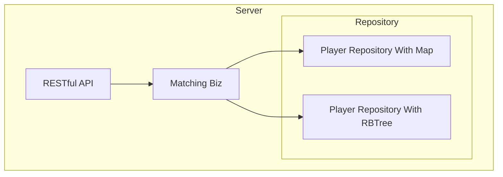

# System Design

## Domain Driven Design

### Bounded Contexts

#### Match Context

在Tinder匹配系統中的`MatchingService`
領域服務扮演著核心業務邏輯的實現者，專責處理單身人士之間的匹配規則。這個服務不僅需要了解每個單身人士的特質和需求，還必須根據這些資訊來找出可能的匹配對象。`MatchingService`
的設計和實作涉及幾個關鍵方面：

##### 職責範圍

1. **匹配算法**：實施具體的匹配邏輯，如根據性別和身高條件進行配對。這需要考慮男性匹配比自己矮的女性，而女性則匹配比自己高的男性。
2. **約會次數管理**：每當發生一次匹配，參與的雙方各消耗一次想要約會的機會。`MatchingService`
   需要追蹤和更新這個數據，一旦任一單身人士的約會次數降至0，便將其從匹配池中移除。
3. **匹配結果通知**：當找到匹配對象時，`MatchingService`可能需要通過某種方式（例如回調、事件發佈等）來通知相關方。

##### 核心方法

- `AddSinglePersonAndMatch(singlePerson SinglePerson) ([]Match, error)`: 接受一個`SinglePerson`
  實體作為參數，將其新增到系統中，並嘗試找出所有可能的匹配。返回匹配成功的列表或錯誤信息。
- `RemoveSinglePerson(singlePersonID string) error`: 根據唯一標識移除一名單身人士。這可能需要更新當前的匹配池，並重新評估已存在的匹配。
- `QueryMatches(maxResults int) ([]Match, error)`: 查詢系統中的匹配對象，可指定返回的最大數量。

##### 匹配邏輯實現

`MatchingService`在實現匹配邏輯時，需要考慮到性能和效率。例如，當新增一名單身人士時，不必遍歷整個單身人士池來尋找匹配對象，而是可以透過維護好的索引或數據結構（如按性別和身高排序的列表）來快速篩選候選人。

##### 技術挑戰

- **資料一致性**：在進行匹配和更新操作時，需要確保資料的一致性，避免因並發訪問而導致的數據錯亂。
- **擴展性**：隨著用戶數量的增加，`MatchingService`需要能夠有效地處理大量的匹配請求，這可能涉及到優化算法或利用更高效的數據結構。

##### 小結

`MatchingService`是Tinder匹配系統中的一個關鍵領域服務，它將領域模型（如單身人士的屬性和需求）與核心業務邏輯（匹配規則）緊密結合。透

## System Architecture

## Time Complexity

### Solution Map

- AddSinglePersonAndMatch: O(n)
- RemoveSinglePerson: O(1)
- QuerySinglePeople: O(n)

### Solution RBTree

- AddSinglePersonAndMatch: O(log n)
- RemoveSinglePerson: O(log n)
- QuerySinglePeople: O(log n)
